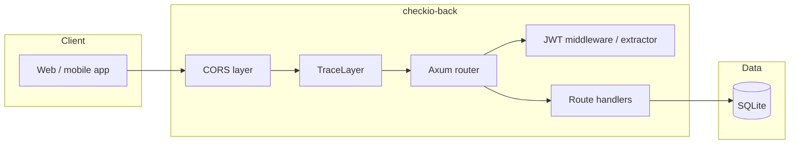
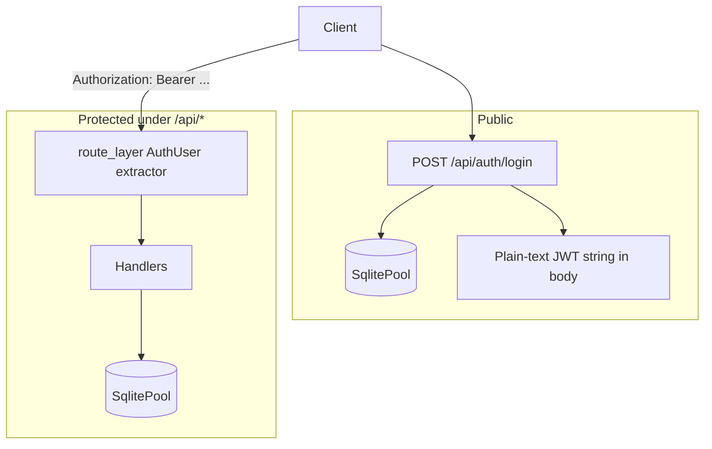
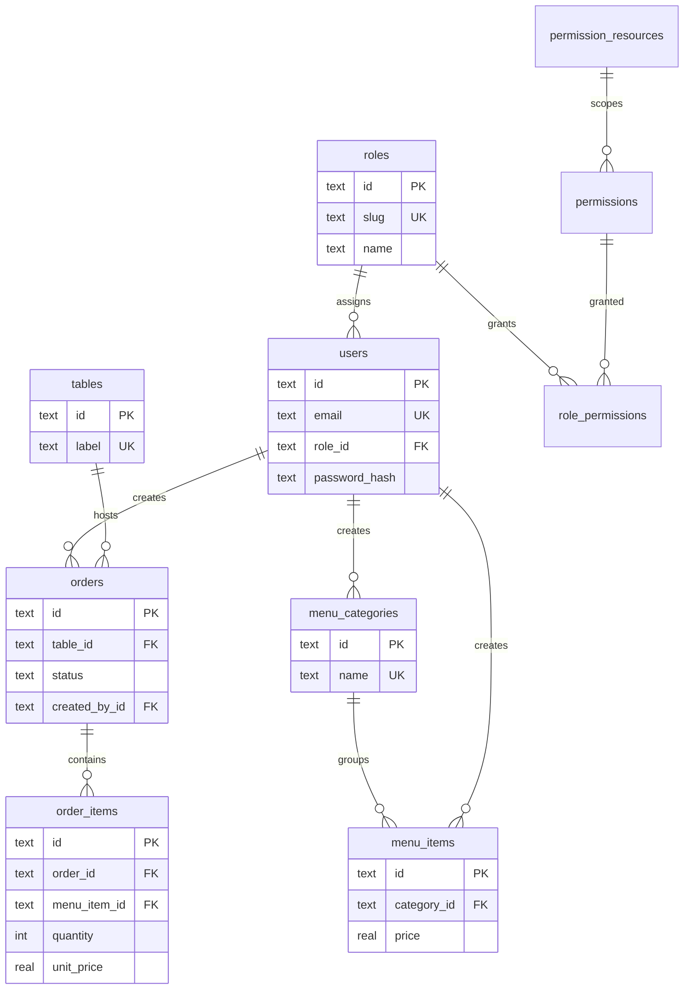

# checkio-back

REST API for a restaurant-style operations backend: staff accounts, RBAC metadata, dining tables, menu categories/items, and orders. Built with **Axum**, **SQLx** (SQLite), and **JWT** bearer authentication.

## Tech stack

| Layer | Choice |
|--------|--------|
| Runtime | Tokio |
| HTTP | Axum 0.8 |
| Database | SQLite via SQLx (macros + migrations) |
| Auth | Argon2 password hashes, JWT (`jsonwebtoken`) |
| Config | `dotenvy` + environment variables |
| Observability | `tracing` + `tower-http` request traces |

Development builds use **offline SQLx** metadata from the checked-in `.sqlx/` directory (see [`.cargo/config.toml`](.cargo/config.toml)), so `cargo check` does not need a live database.

## Repository layout

```text
back/
├── Cargo.toml              # Crate manifest & dependencies
├── .cargo/config.toml      # SQLX_OFFLINE for compile-time query validation
├── .sqlx/                  # Cached query fingerprints (offline mode)
├── migrations/             # Ordered SQL migrations (sqlx::migrate)
├── dev.db                  # Local SQLite file (if used; not required in CI)
└── src/
    ├── main.rs             # Entry: tracing, config, CORS, TCP listen, serve router
    ├── config.rs           # HOST, PORT, DATABASE_URL, JWT_SECRET, CLIENT_ORIGIN
    ├── db.rs               # SQLite pool (foreign keys on) + migrate helper
    ├── auth.rs             # JWT claims encode/decode
    ├── error.rs            # AppError + JSON error responses
    ├── migrations.rs       # Alternate pool/migrate (duplicate of db helpers)
    ├── routes/
    │   ├── mod.rs          # App router: public auth + JWT-protected API nests
    │   ├── auth.rs         # POST /api/auth/login
    │   ├── users.rs
    │   ├── tables.rs
    │   ├── orders.rs
    │   ├── menu_items.rs
    │   └── menu_item_categories.rs
    └── utils/
        ├── auth.rs         # Axum extractor: Bearer JWT → AuthUser { user_id, role }
        └── passwords.rs    # Argon2 verify helper
```

## Architecture (high level)



## Request flow: public vs protected



Protected routes apply `middleware::from_extractor::<AuthUser>()`, which reads `JWT_SECRET` from the environment, parses the `Authorization: Bearer` header, and injects `AuthUser { user_id, role }` for handlers that need it.

> **RBAC in the database:** Migrations seed `roles`, `permission_resources`, `permissions`, and `role_permissions`. The JWT includes a **role slug**, but application handlers do not yet enforce fine-grained permission checks against those tables—that is natural follow-up work if you need server-side authorization beyond “valid logged-in user.”

## HTTP API surface

| Method | Path | Auth |
|--------|------|------|
| `POST` | `/api/auth/login` | No |
| `GET`, `POST` | `/api/users`, `/api/users/{id}` | JWT |
| `GET`, `POST` | `/api/menu_items`, `/api/menu_items/{id}` | JWT |
| `GET`, `POST` | `/api/menu_item_categories`, `/api/menu_item_categories/{id}` | JWT |
| `GET`, `POST` | `/api/orders`, `/api/orders/{id}` | JWT |
| `GET`, `POST` | `/api/tables`, `/api/tables/{id}` | JWT |
| `PATCH` | `/api/tables/{id}` | JWT |

CORS allows `GET`, `POST`, `PUT`, `PATCH` from the configured `CLIENT_ORIGIN`.

## Data model (conceptual)



RBAC tables (`permission_resources`, `permissions`, `role_permissions`) complement `roles` and are populated in [`migrations/20260506203520_create_rbac.sql`](migrations/20260506203520_create_rbac.sql).

## Configuration

| Variable | Purpose |
|----------|---------|
| `DATABASE_URL` | SQLite URL (e.g. `sqlite:dev.db` or `sqlite::memory:`) |
| `JWT_SECRET` | Symmetric key for signing and verifying tokens |
| `CLIENT_ORIGIN` | Allowed browser origin for CORS (parsed as `HeaderValue`) |
| `HOST` | Bind address (default `0.0.0.0`) |
| `PORT` | TCP port (default `3000`) |

Logging uses `RUST_LOG` when set; otherwise defaults include `checkio_back=debug` and related crates.

## Running locally

1. Copy or create a `.env` with the variables above (a `DATABASE_URL` pointing at a file or in-memory DB).
2. Apply migrations to that database (for example with [`sqlx-cli`](https://github.com/launchbadge/sqlx): `sqlx database create` / `sqlx migrate run` from this directory, or by wiring `db::run_migrations` into startup if you prefer).
3. `cargo run`

The server prints the listening address when it starts.

**Migration order:** SQLx runs files in lexical version order. `menu_items` references `menu_categories`, so the categories migration filename must sort **before** the menu-items migration on a fresh database. If `sqlx migrate run` fails on `menu_items`, adjust the migration timestamps (or merge migrations) so categories are created first.

---

*Diagrams use [Mermaid](https://mermaid.js.org/); they render in GitHub, GitLab, and many Markdown viewers.*
